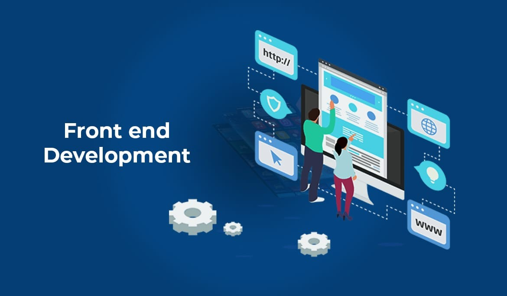
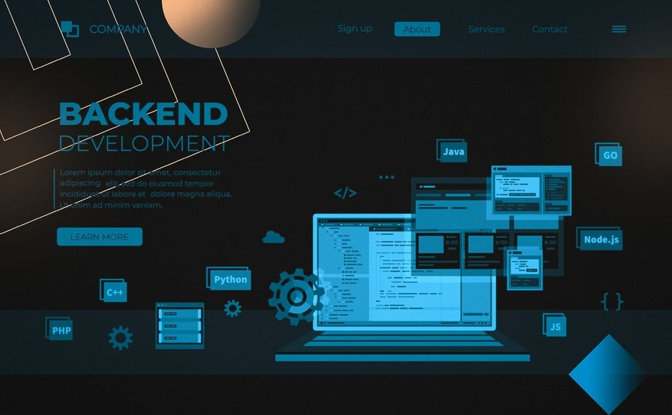
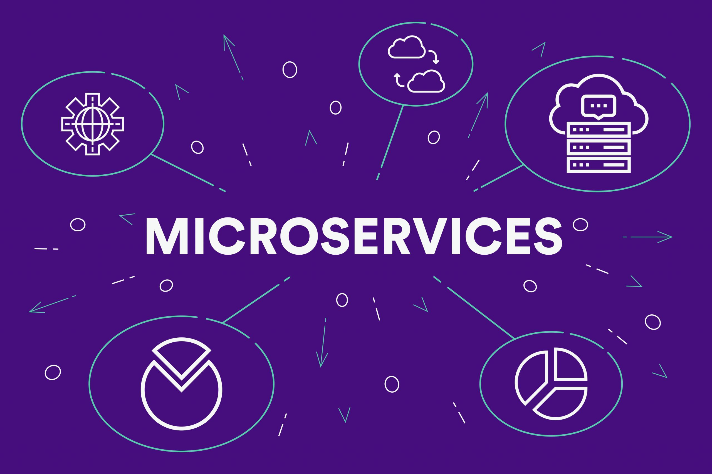
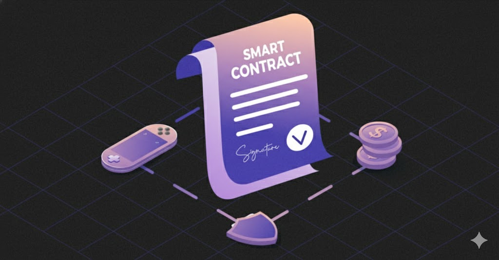
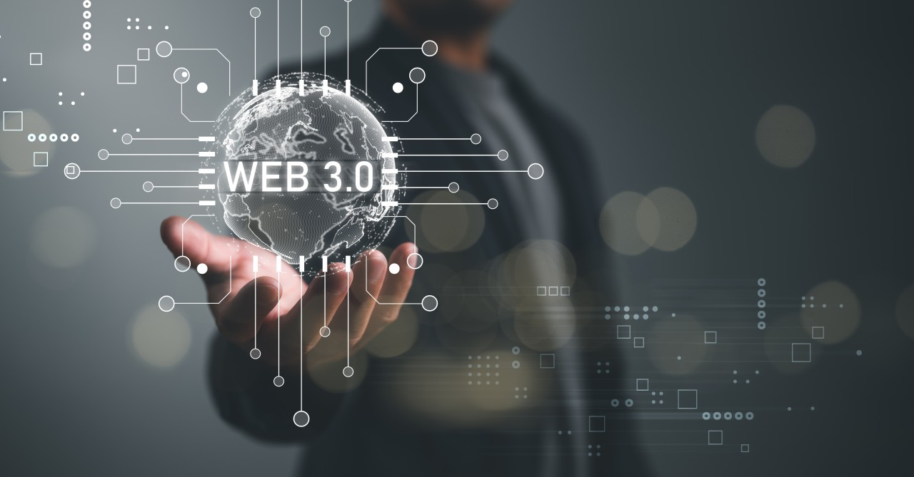
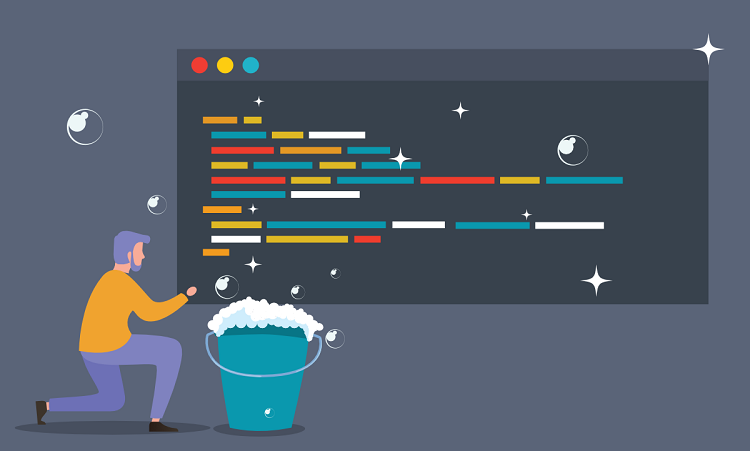

<!-- HEADER -->

  

<h1 align="center">Hi there 👋, I'm Vũ Đức Mạnh</h1>
<h3 align="center">You can call me Michael 🚀</h3>

  

---
## 👨‍💻 About Me
<table>
  <tr>
    <!-- Block 1: Thông tin bản thân -->
    <td align="center" valign="top" width="33%" style="background:#0d1117;border-radius:16px;padding:16px;vertical-align:top;border:1px solid #1f2937;">
       
      <h3 style="color:#56CFE1;">👤 Thông tin bản thân</h3>
      

        Xin chào! Mình là <strong>Vũ Đức Mạnh</strong> (Michael) — sinh năm <strong>2001</strong>, đến từ <strong>Hà Nội, Việt Nam</strong>.  
        Là người yêu thích công nghệ, sáng tạo, và luôn muốn phát triển bản thân thông qua những thử thách mới.  
        Hướng đến việc trở thành một kỹ sư giỏi, có ảnh hưởng tích cực đến cộng đồng dev Việt.
      

      

        
        
        
        
      

    </td>
    <!-- Block 2: Sở thích -->
    <td align="center" valign="top" width="33%" style="background:#0d1117;border-radius:16px;padding:16px;vertical-align:top;border:1px solid #1f2937;">
       
      <h3 style="color:#80FFDB;">🎯 Sở thích</h3>
      

        Ngoài thời gian học và làm việc, mình thích <strong>code</strong> để khám phá công nghệ mới,  
        <strong>du lịch</strong> để mở rộng góc nhìn, và <strong>ăn uống</strong> như một cách tận hưởng cuộc sống.  
        Mình cũng yêu thể thao như <strong>chạy bộ</strong>, <strong>bơi lội</strong> và <strong>gym</strong> để giữ tinh thần thoải mái.
      

      

        
        
        
        
        
        
      

    </td>
    <!-- Block 3: Học vấn -->
    <td align="center" valign="top" width="33%" style="background:#0d1117;border-radius:16px;padding:16px;vertical-align:top;border:1px solid #1f2937;">
       
      <h3 style="color:#72EFDD;">🎓 Học vấn</h3>
      

        Sinh viên <strong>Học viện Công nghệ Bưu chính Viễn thông (PTIT)</strong>, chuyên ngành <strong>Internet of Things</strong>.  
        Mình tập trung vào các môn như <strong>phát triển phần mềm</strong>, <strong>lập trình hướng đối tượng</strong>, <strong>cấu trúc dữ liệu</strong>, và <strong>kỹ thuật hệ thống</strong>,  
        hướng tới sự nghiệp trong lĩnh vực công nghệ cao.
      

      

        
        
        
      

    </td>
  </tr>
</table>

---
### 🚀 What I Do
<table align="center" width="100%" style="border-collapse:separate;border-spacing:20px 20px;">
  <tr align="center">
    <!-- CARD 1 -->
    <td width="33%" valign="top">
      

        
        

          <h3 style="margin:0 0 8px;">🎨 <strong>Frontend Development</strong></h3>
          

            Build modern, responsive UIs using React, Next.js, and React Native with focus on performance & accessibility.
          

          

            
            
            
            
          

        

      

    </td>
    <!-- CARD 2 -->
    <td width="33%" valign="top">
      

        
        

          <h3 style="margin:0 0 8px;">⚙️ <strong>Backend Development</strong></h3>
          

            Build APIs and backend services using Node.js, Express, and Golang with clean architecture and scalability.
          

          

            
            
            
            
          

        

      

    </td>
    <!-- CARD 3 -->
    <td width="33%" valign="top">
      

        
        

          <h3 style="margin:0 0 8px;">🔌 <strong>APIs & Microservices</strong></h3>
          

            Design RESTful APIs, implement authentication, logging, and communication between distributed systems.
          

          

            
            
            
            
          

        

      

    </td>
  </tr>
  <tr align="center">
    <!-- CARD 4 -->
    <td width="33%" valign="top">
      

        
        

          <h3 style="margin:0 0 8px;">🧩 <strong>Smart Contracts</strong></h3>
          

            Design and deploy secure smart contracts optimized for gas and modularity on EVM-compatible networks.
          

          

            
            
            
            
          

        

      

    </td>
    <!-- CARD 5 -->
    <td width="33%" valign="top">
      

        
        

          <h3 style="margin:0 0 8px;">🌐 <strong>Web3 Integration</strong></h3>
          

            Integrate decentralized apps with wallets, fetch on-chain data and connect networks seamlessly.
          

          

            
            
            
            
          

        

      

    </td>
    <!-- CARD 6 -->
    <td width="33%" valign="top">
      

        
        

          <h3 style="margin:0 0 8px;">✨ <strong>Clean Code & UX</strong></h3>
          

            Focus on maintainable code, intuitive UI, and DX-first development with reusable components.
          

          

            
            
            
            
          

        

      

    </td>
  </tr>
</table>

---
### 🧠 Tech Stack  

   
   
   
  

---

### 🌱 Currently Exploring  

- 🔐 **Smart Contract Security** (reentrancy, overflow, access control)  
- ⚡ **Scaling dApps** on Layer 2 (Arbitrum, Optimism, zkSync)  
- ☁️ DevOps pipelines (Docker + CI/CD + cloud deployment)

---

### 📊 GitHub Insights  

  
  

---

### 🧩 Featured Projects  

> 🧱 **[DeFi Dashboard](#)** — A Web3 dashboard for managing DeFi assets and tracking smart contracts.  
> 🌐 **[Portfolio Website](#)** — Personal portfolio showcasing my works, built with Next.js & TailwindCSS.  
> 🔗 **[NFT Marketplace](#)** — Solidity-based marketplace with Ethers.js integration.

---

### 🤝 Connect With Me  

  
  
  

---

### ⚡ Fun Fact  
> “Turning complex ideas into elegant digital experiences.”  
>  
> Every line of code I write is a step toward bridging creativity and technology 🌍  

---

  
  

