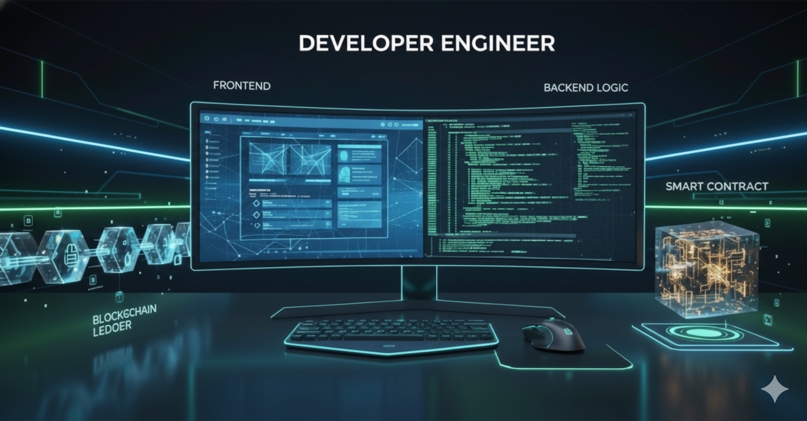
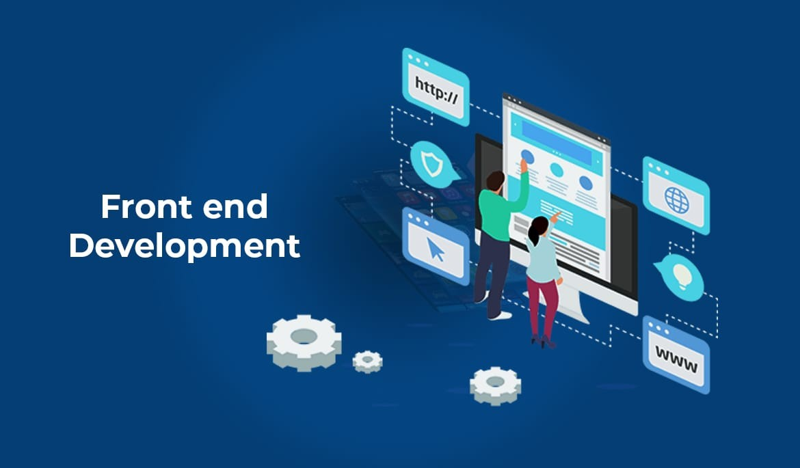
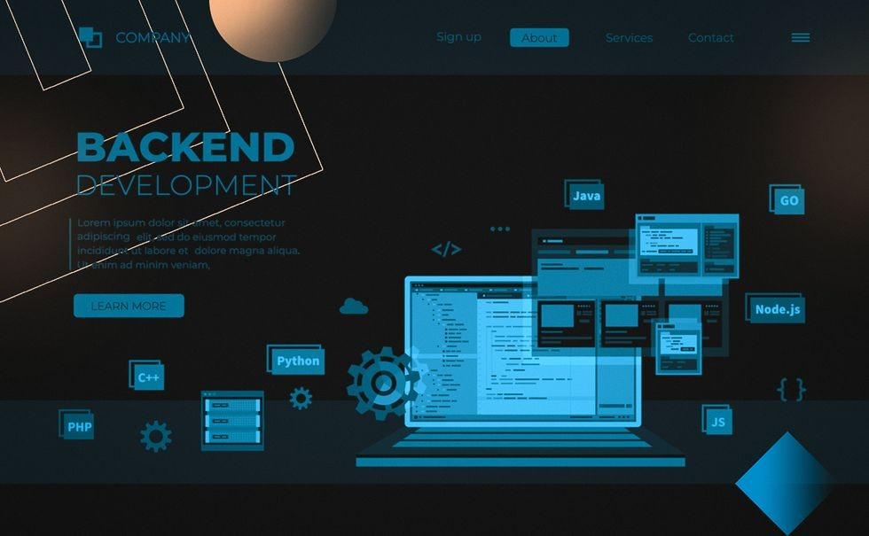
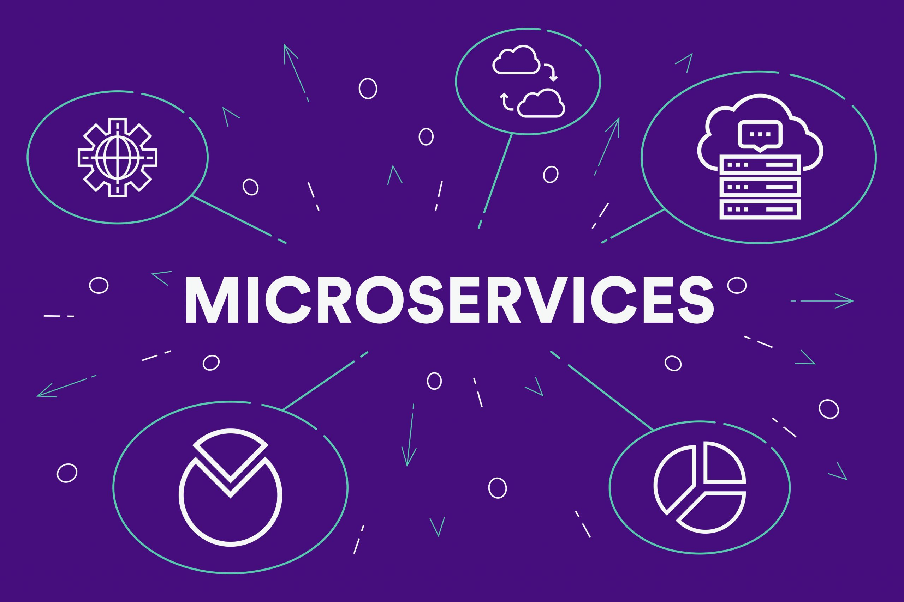
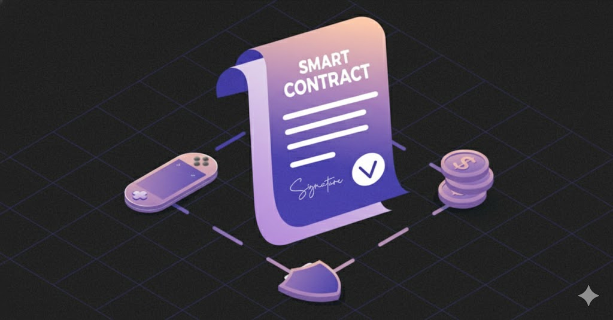
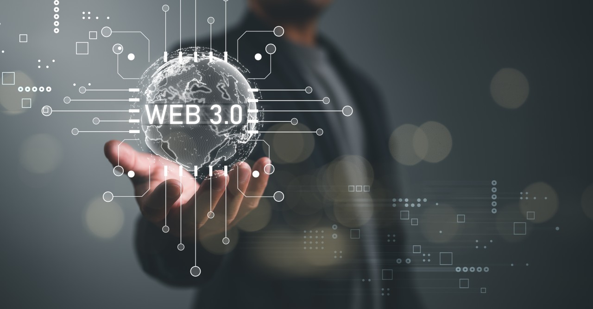
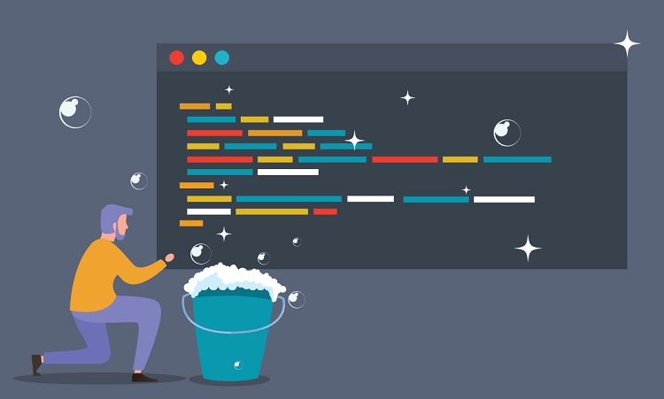

<!-- HEADER -->

  

<h1 align="center">Hi there 👋, I'm Vũ Đức Mạnh</h1>
<h3 align="center">You can call me Michael 🚀</h3>

  

---
# 🚀 What I Do
<table align="center" width="100%" style="border-collapse:separate;border-spacing:20px 20px;">
  <tr align="center">
    <!-- CARD 1 -->
    <td width="33%" valign="top">
      

        
        

          <h3 style="margin:0 0 8px;">🎨 <strong>Frontend Development</strong></h3>
          

            Build modern, responsive UIs using React, Next.js, and React Native with focus on performance & accessibility.
          

          

            
            
            
            
          

        

      

    </td>
    <!-- CARD 2 -->
    <td width="33%" valign="top">
      

        
        

          <h3 style="margin:0 0 8px;">⚙️ <strong>Backend Development</strong></h3>
          

            Build APIs and backend services using Node.js, Express, and Golang with clean architecture and scalability.
          

          

            
            
            
            
          

        

      

    </td>
    <!-- CARD 3 -->
    <td width="33%" valign="top">
      

        
        

          <h3 style="margin:0 0 8px;">🔌 <strong>APIs & Microservices</strong></h3>
          

            Design RESTful APIs, implement authentication, logging, and communication between distributed systems.
          

          

            
            
            
            
          

        

      

    </td>
  </tr>
  <tr align="center">
    <!-- CARD 4 -->
    <td width="33%" valign="top">
      

        
        

          <h3 style="margin:0 0 8px;">🧩 <strong>Smart Contracts</strong></h3>
          

            Design and deploy secure smart contracts optimized for gas and modularity on EVM-compatible networks.
          

          

            
            
            
            
          

        

      

    </td>
    <!-- CARD 5 -->
    <td width="33%" valign="top">
      

        
        

          <h3 style="margin:0 0 8px;">🌐 <strong>Web3 Integration</strong></h3>
          

            Integrate decentralized apps with wallets, fetch on-chain data and connect networks seamlessly.
          

          

            
            
            
            
          

        

      

    </td>
    <!-- CARD 6 -->
    <td width="33%" valign="top">
      

        
        

          <h3 style="margin:0 0 8px;">✨ <strong>Clean Code & UX</strong></h3>
          

            Focus on maintainable code, intuitive UI, and DX-first development with reusable components.
          

          

            
            
            
            
          

        

      

    </td>
  </tr>
</table>

---
# 🧠 Tech Stack

<table>
  <tr>
    <td valign="top" width="60%">
      <h4>🎨 Frontend</h4>
       
      <h4>⚙️ Backend</h4>
       
      <h4>🗄️ Database / SQL</h4>
       
      <h4>⛓️ Blockchain</h4>
       
      <h4>🧰 Tools</h4>
      
    </td>
    <td valign="top" width="40%">
      <h3>📊 Most Used Languages</h3>
      
    </td>
  </tr>
</table>

---
# 🌱 Currently Exploring  

- 🔐 **Smart Contract Security** (reentrancy, overflow, access control)  
- ⚡ **Scaling dApps** on Layer 2 (Arbitrum, Optimism, zkSync)  
- ☁️ DevOps pipelines (Docker + CI/CD + cloud deployment)

---
### 📊 GitHub Insights  

  

---
# 🧩 Featured Projects  

> 🪙 **[Blockchain Wallet](#https://play.google.com/store/apps/details?id=com.fidecmobile&hl=vi)** — A multi-chain crypto wallet supporting Bitcoin, Solana, and all EVM-compatible networks. Seamlessly send, receive, and manage tokens and NFTs with integrated Solidity smart contract and Ethers.js support.
> 🎨 **[NFT Marketplace](#https://play.google.com/store/apps/details?id=com.fidecmobile&hl=vi)** — A decentralized NFT marketplace built on EVM chains with Solidity and Ethers.js. Create, trade, and manage NFTs directly from your blockchain wallet.

---

# 🤝 Connect With Me  

  
  
  

---

  
  

